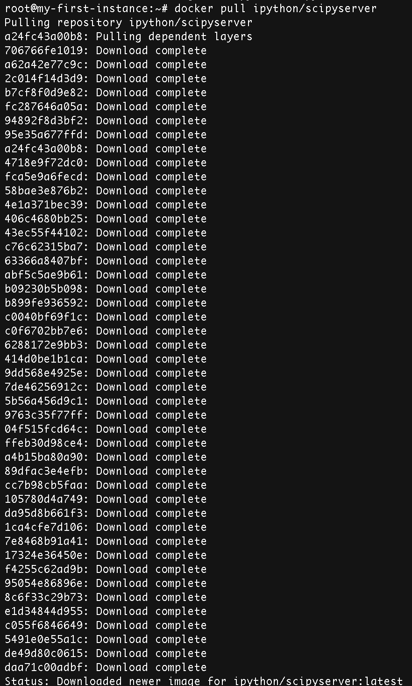

# Basic Syntax and Commands
# Fat vs Thin Dockerfiles
- avoid including intermediate build artifacts
- command chaining vs many layers
- simplest possible
```
FROM scratch
ADD bin/helloworld /helloworld
CMD ["/helloworld"]
```

http://blog.xebia.com/2014/07/04/create-the-smallest-possible-docker-container/
- a single RUN step that calls out to shell script or a config management tool
- Avoid this:



# Some Examples
- http://blog.tutum.co/2014/10/22/how-to-optimize-your-dockerfile/
- https://github.com/pblittle/docker-logstash/blob/master/1.4/base/Dockerfile

# Gotchas
- http://kimh.github.io/blog/en/docker/gotchas-in-writing-dockerfile-en/

# Alternative approaches to building images
- packer
- docker export / import

# exercise create simple one that installs and runs nginx
